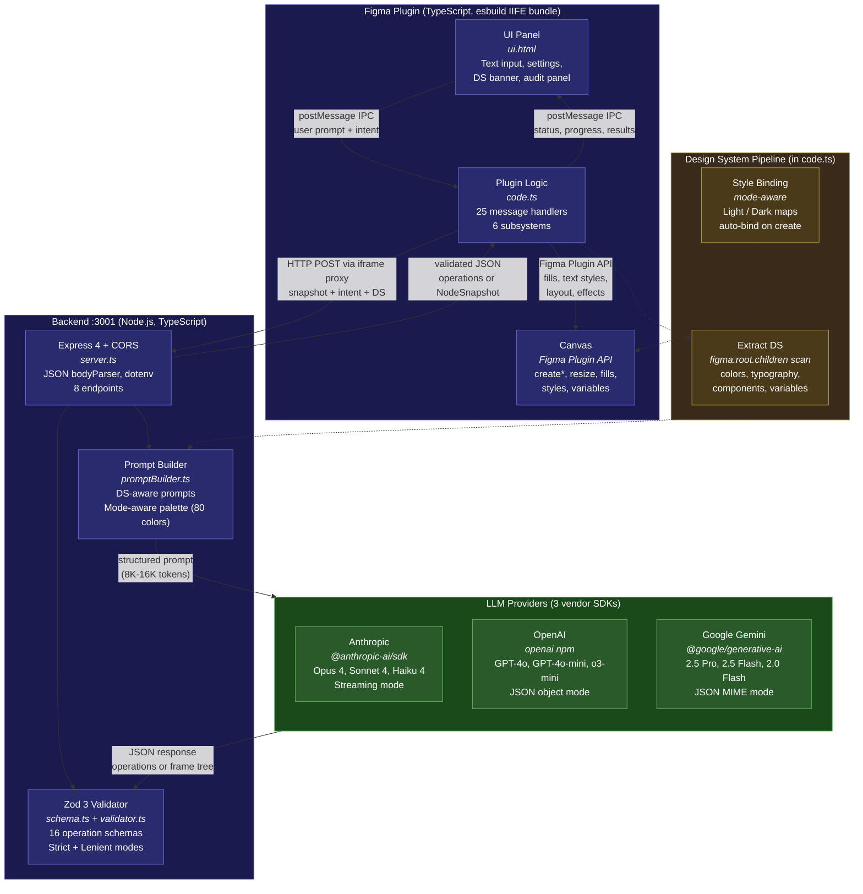
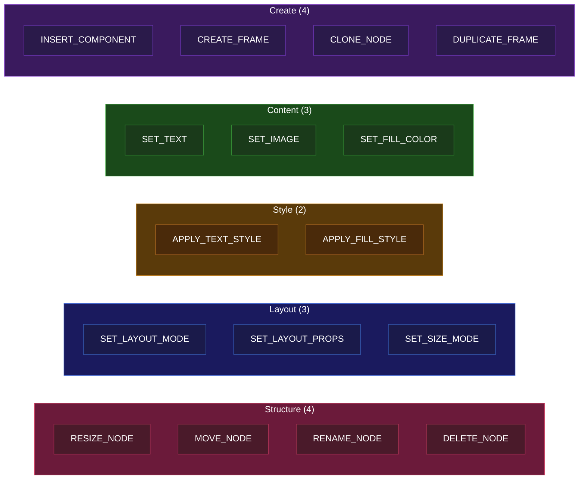
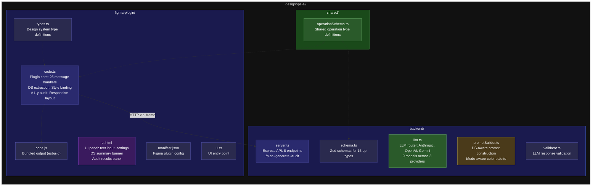
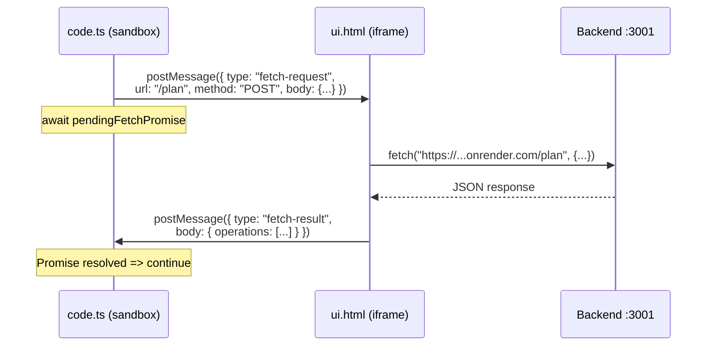
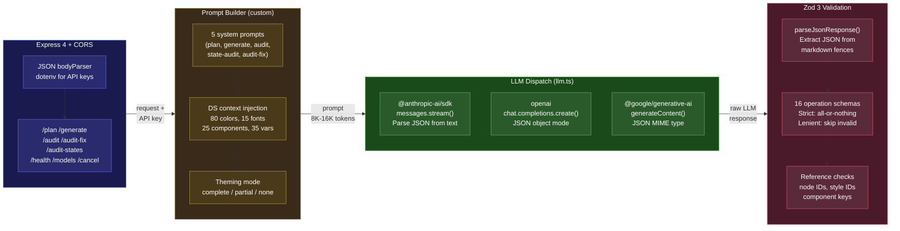

# Uno Design Assistant — Architecture Diagrams

> Updated: February 2026 · ~13,000 lines across 10 files · 13 sections · 7 diagrams

---

## 1. System Architecture

---

## 2. Generate Flow — with Design System Binding

```mermaid
sequenceDiagram
    actor User
    participant Plugin as Figma Plugin<br/>code.ts
    participant Backend as Backend<br/>:3001
    participant LLM as LLM Provider<br/>(Claude/GPT/Gemini)

    User->>Plugin: "Create a Login Dark screen"

    rect rgb(50, 30, 80)
        Note over Plugin: Capture & Prepare
        Plugin->>Plugin: extractDesignSystemSnapshot()
        Plugin->>Plugin: extractStyleTokens() from selection
        Plugin->>Plugin: detectThemeMode("dark") => mode=dark
        Plugin->>Plugin: ensurePaintStyleMaps()<br/>Light/ map, Dark/ map, Unscoped map
    end

    rect rgb(40, 40, 80)
        Note over Plugin,Backend: AI Generation
        Plugin->>Backend: POST /generate<br/>{prompt, styleTokens, designSystem, fullDesignSystem}
        Backend->>Backend: buildGeneratePrompt()<br/>+ formatFullDesignSystemSection()<br/>+ DS color palette (80 colors, by mode)
        Backend->>LLM: Structured prompt (16K max tokens)
        LLM-->>Backend: JSON NodeSnapshot tree
        Backend->>Backend: Validate structure
        Backend-->>Plugin: NodeSnapshot
    end

    rect rgb(30, 60, 30)
        Note over Plugin: Create & Bind
        Plugin->>Plugin: createNodeFromSnapshot(snapshot, page)
        loop Each node in tree
            Plugin->>Plugin: Create FRAME / TEXT / RECT / ELLIPSE
            Plugin->>Plugin: Set fills from hex
            Plugin->>Plugin: tryBindFillStyle(node, hex)<br/>Dark/ map preferred (mode=dark)
            Plugin->>Plugin: tryBindTextStyle(node, font)
        end
        Plugin->>Plugin: Place on canvas, set position
    end

    Plugin-->>User: Done -- N frames, M texts created<br/>Paint styles auto-bound
```

---

## 3. Edit Flow — Responsive Layout Pipeline

```mermaid
sequenceDiagram
    actor User
    participant Plugin as Figma Plugin<br/>code.ts
    participant Backend as Backend<br/>:3001
    participant LLM as LLM Provider

    User->>Plugin: "Make a desktop version"

    rect rgb(50, 30, 80)
        Note over Plugin: Capture Design
        Plugin->>Plugin: snapshotNode() -- JSON tree<br/>(max depth 15, images as base64)
        Plugin->>Plugin: detectResponsiveType()<br/>=> mobile-to-desktop
    end

    rect rgb(60, 40, 20)
        Note over Plugin: Pre-Process (if responsive)
        Plugin->>Plugin: DUPLICATE_FRAME => clone at 1440px
        Plugin->>Plugin: preProcessDesktopLayout()<br/>moveBottomNavToTop()<br/>applyDesktopPadding()<br/>transformHeroSections()<br/>convertCardListsToGrid()
        Plugin->>Plugin: Re-snapshot the modified tree
    end

    rect rgb(40, 40, 80)
        Note over Plugin,LLM: AI Planning
        Plugin->>Backend: POST /plan {snapshot, intent, designSystem}
        Backend->>Backend: buildUserPrompt()<br/>+ formatFullDesignSystemSection()
        Backend->>LLM: Structured prompt (8K max tokens)
        LLM-->>Backend: JSON operations array
        Backend->>Backend: Validate with Zod (16 op types, max 50)
        Backend-->>Plugin: Validated operations
    end

    rect rgb(30, 60, 30)
        Note over Plugin: Apply to Canvas
        loop Each operation
            Plugin->>Plugin: applyOperation() dispatcher<br/>=> resize, restyle, reorder...
            Plugin->>Plugin: Safety checks (width, contrast)
        end
        Plugin->>Plugin: captureRevertState() for undo
    end

    Plugin-->>User: Done -- N operations applied
```

---

## 4. 16 Operation Types — Edit Flow

---

## 5. File Structure

---

## Key Stats

| Area | Count |
|------|-------|
| Total lines | ~13,000 |
| LLM providers | 3 (Anthropic, OpenAI, Gemini) |
| LLM models | 9 |
| Backend endpoints | 8 |
| Plugin message handlers | 25 |
| Edit operation types | 16 |
| Max operations per batch | 50 |
| Max generate tokens | 16,384 |
| DS palette colors sent | 80 |
| Paint style binding | Mode-aware (Light/Dark/Unscoped) |

---

## 6. Technology Stack Reference

A complete map of every technology, SDK, library, and external service used at each layer.

### Dependency Summary

| Layer | Package | Version | Role |
|-------|---------|---------|------|
| **Plugin** | `@figma/plugin-typings` | ^1.104.0 | TypeScript types for the Figma Plugin API |
| **Plugin** | `esbuild` | ^0.24.0 | Bundles `code.ts` → `code.js` (IIFE, ES2017) |
| **Backend** | `express` | ^4.21.0 | HTTP server with JSON body parsing, CORS |
| **Backend** | `cors` | ^2.8.5 | Cross-origin headers for Figma iframe requests |
| **Backend** | `dotenv` | ^17.3.1 | Loads `.env` for API keys and config |
| **Backend** | `@anthropic-ai/sdk` | ^0.76.0 | Anthropic Claude API — streaming messages |
| **Backend** | `openai` | ^6.22.0 | OpenAI API — JSON object mode completions |
| **Backend** | `@google/generative-ai` | ^0.24.1 | Google Gemini API — JSON MIME content generation |
| **Backend** | `zod` | ^3.24.0 | Schema validation for LLM-returned operations |
| **Backend** | `esbuild` | ^0.24.0 | Bundles `server.ts` → `dist/server.js` (CJS, node18) |
| **Backend** | `tsx` | ^4.19.0 | Direct TypeScript execution for development |
| **Shared** | `typescript` | ^5.7.0 | Type system for both plugin and backend |

### Build Modes

| Command | What it does |
|---------|-------------|
| `npm run build:plugin` | esbuild: `code.ts` → `code.js` (IIFE, ES2017) |
| `npm run watch:plugin` | Same as above, in watch mode |
| `npm run build:backend` | esbuild: `server.ts` → `dist/server.js` (CJS, node18, externals for LLM SDKs) |
| `npm run start:backend` | `tsx backend/server.ts` — run TypeScript directly |
| `npm run dev:backend` | `tsx watch backend/server.ts` — watch mode for dev |
| `npm run typecheck` | `tsc --noEmit` — full workspace type check |

---

## 7. Plugin Internals — 6 Subsystems

`code.ts` (~8,300 lines) is organized into 6 major subsystems, each with distinct responsibilities and Figma API usage patterns.

### Subsystem Details

#### 1. Snapshot Engine
**Purpose:** Convert live Figma node trees into portable JSON representations for LLM consumption.

| Function | Responsibility | Key Figma APIs |
|----------|---------------|----------------|
| `snapshotNode()` | Recursive depth-first traversal (max 15 levels). Captures geometry, layout mode, padding, spacing, sizing, text properties, fills, strokes, effects, opacity, corner radii, clipping. | `node.type`, `node.width`, `node.layoutMode`, `node.fills`, `node.effects`, `node.characters` |
| `extractSelectionSnapshot()` | Reads `figma.currentPage.selection` and snapshots each selected node. | `figma.currentPage.selection` |
| `embedImagesInSnapshot()` | Exports visible image fills as base64 PNG at 2x scale. Attaches `imageData` field to snapshot nodes. | `node.exportAsync({ format: 'PNG', constraint: { type: 'SCALE', value: 2 } })` |
| `truncateSnapshotForGenerate()` | Two-tier trimming: first strips non-essential fields, then truncates deep subtrees — keeps token budget under control for the `/generate` endpoint. | — |
| `_compactSnapshot()` | Lightweight snapshot that omits image data. Used for reference frames when generating. | — |

#### 2. Design System Extractor
**Purpose:** Scan the Figma document (all pages) to build a comprehensive design system representation sent alongside every LLM request.

| Function | Responsibility | Key Figma APIs |
|----------|---------------|----------------|
| `extractDesignSystemSnapshot()` | Quick local extraction: text styles, fill styles, components, variables from the current page. | `figma.getLocalPaintStyles()`, `figma.getLocalTextStyles()`, `figma.currentPage.findAll()` |
| `extractFullDocumentDesignSystem()` | Cross-page deep scan: color palette with role inference (primary, secondary, surface, text, etc.), typography scale, spacing scale, corner radii, components with full variant data, variables with mode values (Light/Dark). Cached with a document hash. | `figma.root.children` (all pages), `figma.variables.getLocalVariableCollectionsAsync()`, `figma.variables.getVariableByIdAsync()` |
| `extractStyleTokens()` | Walks page frames collecting *actual* colors, radii, fonts, spacings, button/input styles. Uses a 60-second raw cache to avoid redundant scans. | `figma.currentPage.children`, `node.fills`, `node.cornerRadius`, `node.fontSize` |

#### 3. Style Binder
**Purpose:** Automatically bind LLM-generated hex colors and font specifications to the document's local paint and text styles, respecting theme modes.

| Function | Responsibility | Key Figma APIs |
|----------|---------------|----------------|
| `ensurePaintStyleMaps()` | Builds three lookup maps keyed by hex color: `Light/` prefixed styles, `Dark/` prefixed styles, and unscoped styles. | `figma.getLocalPaintStyles()` |
| `ensureTextStyleMap()` | Builds a `fontFamily-weight-size` → `textStyleId` map from local text styles. | `figma.getLocalTextStyles()` |
| `tryBindFillStyle()` | Given a node + hex, looks up the paint style map (preferring Dark/ map when `mode=dark`) and sets `node.fillStyleId`. | `node.fillStyleId =` |
| `tryBindTextStyle()` | Given a text node + font spec, resolves to a text style ID and binds. | `node.textStyleId =` |
| `detectThemeMode()` | Regex-based detection of "dark", "light", "night" etc. in the user's prompt text. | — |

#### 4. Operation Applier
**Purpose:** Execute validated LLM operations on the Figma canvas with safety checks and revert support.

| Function | Responsibility | Key Figma APIs |
|----------|---------------|----------------|
| `applyOperation()` | Switch dispatcher routing to 16 type-specific handlers (see §4 above). | Various `figma.create*()`, `node.resize()`, `node.remove()` |
| `captureRevertState()` | Before applying a batch, serializes the current state of every affected node (position, size, fills, text, layout). Stored in `figma.clientStorage`. | `figma.clientStorage.setAsync()` |
| `revertLast()` | Reads the saved revert state and restores each node's properties. Handles deleted nodes by recreating them. | `figma.clientStorage.getAsync()`, `figma.getNodeById()` |

#### 5. Audit Engine
**Purpose:** Run WCAG accessibility checks locally, enrich findings with LLM suggestions, and apply fixes.

| Function | Responsibility | Key Figma APIs |
|----------|---------------|----------------|
| `runAccessibilityAudit()` | Traverses selected frames checking: color contrast (WCAG AA/AAA), touch target sizes (44×44), minimum font sizes, opacity issues, missing alt text. | `node.fills`, `node.width`, `node.height`, `node.fontSize`, `node.opacity` |
| `applyAutoFix()` | Deterministic fixes: compute compliant color, resize to minimum, adjust opacity. No LLM call needed. | `node.fills = [...]`, `node.resize()` |
| `applyLLMFix()` | For complex findings, calls `/audit-fix` endpoint to get a structured fix (property + value + explanation), then applies it. | Via HTTP → backend |
| `createAuditBadges()` | Creates colored badge frames on the canvas next to each finding (red for errors, orange for warnings). | `figma.createFrame()`, `figma.createText()` |
| `clearAuditBadges()` | Finds and removes all badge frames (matched by naming convention). | `figma.currentPage.findAll()`, `node.remove()` |

Helper functions: `auditLuminance()`, `auditContrastRatio()`, `computeCompliantColor()`, `isNodeHidden()`, `isTouchTargetAutoLayout()`.

#### 6. Responsive Pipeline
**Purpose:** Transform designs between mobile and desktop form factors through deterministic pre-processing before LLM-driven refinement.

| Function | Responsibility |
|----------|---------------|
| `detectResponsiveType()` | Analyzes intent string and frame dimensions to classify as `mobile-to-desktop`, `desktop-to-mobile`, or `none`. |
| `preProcessDesktopLayout()` | Orchestrates mobile→desktop transforms: moves bottom nav to top, applies desktop padding (64px), transforms hero sections to horizontal split, converts vertical card lists to grid. |
| `scaleSubtree()` | Proportionally scales an entire node subtree (width, height, font sizes, padding, spacing) by a given factor. |
| `normalizeGridCells()` | After scaling, normalizes grid cell widths to use equal fractions of the container. |
| `tightFitAutoLayout()` | Shrinks auto-layout frames to hug their content (removes excess whitespace after transforms). |
| `fixRunawaySizing()` | Finds children with FILL sizing that overflow the target width and converts them to FIXED. |
| `fixContrastRecursive()` | Post-processes cloned/generated frames to ensure text contrast meets WCAG minimums. |

---

## 8. UI ↔ Plugin Communication Map

The Figma plugin uses a split architecture: `ui.html` runs in a browser iframe, while `code.ts` runs in the Figma sandbox. They communicate exclusively via `postMessage`. Additionally, `ui.html` acts as an **HTTP proxy** because the sandbox cannot make `fetch` calls directly.

### Message Types: UI → Plugin (16 types)

| Message | Payload | Triggers |
|---------|---------|----------|
| `run` | `{ intent }` | Primary generate/edit flow (auto-detects intent) |
| `generate` | `{ prompt }` | Direct generate-frame flow |
| `cancel` | — | Cancel serial plan+apply |
| `cancel-job` | `{ jobId }` | Cancel specific parallel job |
| `revert-last` | — | Undo last operation batch |
| `export-json` | — | Export selection to JSON |
| `import-json` | `{ json }` | Recreate nodes from JSON |
| `generate-docs` | — | Generate design documentation |
| `audit-a11y` | — | Run accessibility audit |
| `audit-states` | — | Run UI state completeness audit |
| `clear-audit` | — | Remove audit badges |
| `fix-finding` | `{ finding }` | Fix a single audit finding |
| `fix-all-auto` | — | Batch auto-fix all deterministic findings |
| `select-node` | `{ nodeId }` | Select node + zoom into view |
| `extract-design-system` | — | Full cross-page DS extraction |
| `cancel-extract-ds` | — | Cancel DS extraction |

### Message Types: Plugin → UI (28+ types)

| Message | Payload | Purpose |
|---------|---------|---------|
| `status` | `{ message, phase? }` | Update progress text and bar segment |
| `plan-result` | `{ operations, timings }` | Edit flow completed successfully |
| `plan-error` | `{ error }` | Edit flow failed |
| `generate-result` | `{ snapshot, timings }` | Generate flow completed |
| `generate-error` | `{ error }` | Generate flow failed |
| `job-created` | `{ jobId, prompt }` | Parallel job started |
| `job-progress` | `{ jobId, phase }` | Parallel job phase update |
| `job-done` | `{ jobId }` | Parallel job completed |
| `job-error` | `{ jobId, error }` | Parallel job failed |
| `audit-result` | `{ findings }` | A11y audit findings |
| `state-audit-result` | `{ items }` | State audit results |
| `ds-extraction-progress` | `{ page, total }` | DS scan progress |
| `ds-extraction-done` | `{ designSystem }` | DS extraction completed |
| `providers-list` | `{ providers }` | Available LLM providers/models |
| `key-validation-result` | `{ valid, error? }` | API key test result |
| `export-json-data` | `{ json }` | JSON export payload |
| `docs-data` | `{ markdown }` | Generated documentation |
| `fetch-request` | `{ url, method, headers, body }` | HTTP proxy request (UI executes fetch) |
| `revert-result` | — | Revert completed |
| `save-timings` | `{ timings }` | Phase timing data to persist |
| `save-audit-timings` | `{ timings }` | Audit timing data to persist |
| `save-state-audit-timings` | `{ timings }` | State audit timing data |

### The HTTP Proxy Pattern

The Figma plugin sandbox **cannot** make network requests directly. To reach the backend:

1. `code.ts` posts a `fetch-request` message to `ui.html` with URL, method, headers, and body
2. `ui.html` executes the `fetch()` call (with `AbortController` for cancellation)
3. On completion, `ui.html` posts back `fetch-result` (with JSON body) or `fetch-error` / `fetch-aborted`
4. `code.ts` resolves/rejects a stored Promise, giving callers a standard async interface

---

## 9. Backend Internals — Request Processing Pipeline

Detailed view of how the backend processes each request type, from endpoint routing through prompt construction, LLM dispatch, validation, and response.

### Endpoint Reference

| Endpoint | Method | Request Body | Response | Token Limit | Notes |
|----------|--------|-------------|----------|-------------|-------|
| `/health` | GET | — | `{ status: "ok" }` | — | Simple liveness check |
| `/models` | GET | — | `{ providers: [{ id, label, models: [{ id, label }] }] }` | — | Serves config to UI settings panel |
| `/validate-key` | POST | `{ apiKey, provider }` | `{ valid: boolean, error?: string }` | 1 token | Minimal LLM call to verify key works |
| `/cancel` | POST | — | `{ status: "cancelled" }` | — | Calls `cancelCurrentRequest()` → `AbortController.abort()` |
| `/plan` | POST | `{ intent, selection, designSystem, fullDesignSystem?, apiKey, provider, model }` | `{ operations: Operation[] }` | 8,192 | `?lenient=true` query param for lenient validation |
| `/generate` | POST | `{ prompt, styleTokens, designSystem, selection?, fullDesignSystem?, apiKey, provider, model }` | `{ snapshot: NodeSnapshot }` | 16,384 | Hard safety cap: 500K char user prompt |
| `/audit` | POST | `{ findings, apiKey, provider, model }` | `{ findings: AuditFinding[] }` | 4,096 | Enriches local findings with LLM suggestions |
| `/audit-fix` | POST | `{ finding, apiKey, provider, model }` | `{ fix: { property, value, explanation } }` | 2,048 | Structured fix for a single finding |
| `/audit-states` | POST | `{ items, apiKey, provider, model }` | `{ items: StateAuditItem[] }` | 8,192 | UI state completeness analysis |

### LLM Provider Comparison

| Aspect | Anthropic | OpenAI | Gemini |
|--------|-----------|--------|--------|
| **SDK** | `@anthropic-ai/sdk` | `openai` | `@google/generative-ai` |
| **Call pattern** | Streaming (`messages.stream()`) | Non-streaming (`chat.completions.create()`) | Non-streaming (`generateContent()`) |
| **JSON mode** | Parse from raw text | `response_format: { type: "json_object" }` | `responseMimeType: "application/json"` |
| **Why streaming?** | Avoids "streaming required for long requests" error on Claude | Not needed | Not needed |
| **Client caching** | `Map<apiKey, Anthropic>` | `Map<apiKey, OpenAI>` | `Map<apiKey, GoogleGenerativeAI>` |
| **Cancellation** | `AbortController.signal` | `AbortController.signal` | `AbortController.signal` |
| **Error recovery** | `parseJsonResponse()` extracts JSON from markdown fences | Same | Same |

### LLM Function Variants

| Function | System Prompt | Max Tokens | Used By |
|----------|--------------|------------|---------|
| `callLLM()` | `SYSTEM_PROMPT` | 8,192 | `/plan` |
| `callLLMGenerate()` | `GENERATE_SYSTEM_PROMPT` | 16,384 | `/generate` |
| `callLLMAudit()` | Inline audit prompt | 4,096 | `/audit` |
| `callLLMStateAudit()` | Inline state audit prompt | 8,192 | `/audit-states` |
| `callLLMAuditFix()` | Inline fix prompt | 2,048 | `/audit-fix` |

---

## 10. Validation Pipeline — Strict & Lenient Modes

The backend validates LLM responses through a two-mode pipeline. **Strict mode** validates the entire batch at once — if any operation fails, the whole batch is rejected. **Lenient mode** (activated via `?lenient=true` query param) validates each operation individually, skipping invalid ones while keeping the rest. Both modes perform reference integrity checks (node IDs, component keys, style IDs) after structural validation.

### Zod Schema Details — 16 Operation Types

| Schema | Required Fields | Optional Fields | Constraints |
|--------|----------------|-----------------|-------------|
| `InsertComponentSchema` | `componentKey`, `parentId` | — | Both strings min length 1 |
| `CreateFrameSchema` | `parentId`, `name` | `layout: { direction, spacingToken, paddingToken }` | — |
| `SetTextSchema` | `nodeId`, `text` | — | `text` allows empty string |
| `ApplyTextStyleSchema` | `nodeId`, `styleId` | — | — |
| `ApplyFillStyleSchema` | `nodeId`, `styleId` | — | — |
| `RenameNodeSchema` | `nodeId`, `name` | — | — |
| `SetImageSchema` | `nodeId`, `imagePrompt` | — | Backend resolves prompt → base64 |
| `ResizeNodeSchema` | `nodeId` | `width`, `height` | Both positive numbers; at least one required (enforced in validator) |
| `MoveNodeSchema` | `nodeId`, `x`, `y` | — | x, y are numbers |
| `CloneNodeSchema` | `nodeId`, `parentId` | `insertIndex` | insertIndex: non-negative integer |
| `DeleteNodeSchema` | `nodeId` | — | — |
| `DuplicateFrameSchema` | `nodeId` | `variantIntent` | — |
| `SetFillColorSchema` | `nodeId`, `color` | — | `color` regex: `^#[0-9a-fA-F]{6}$` |
| `SetLayoutModeSchema` | `nodeId`, `layoutMode` | `wrap` | layoutMode: `HORIZONTAL` \| `VERTICAL` \| `NONE` |
| `SetLayoutPropsSchema` | `nodeId` | `paddingTop/Right/Bottom/Left`, `itemSpacing`, `counterAxisSpacing` | All non-negative numbers |
| `SetSizeModeSchema` | `nodeId` | `horizontal`, `vertical` | Both: `FIXED` \| `FILL` \| `HUG` |

**Batch constraint:** `OperationBatchSchema` enforces max 50 operations per batch.

---

## 11. Design System Pipeline — Extraction, Formatting & Binding

The design system pipeline operates in four phases:

1. **Local Extraction** — `extractFullDocumentDesignSystem()` scans ALL pages via `figma.root.children`, collecting paint styles (hex + name + role inference), text styles (font, size, weight, role), components (key, name, page, variants), and variables with mode values (Light/Dark). Results cached with a document hash.
2. **Style Token Extraction** — `extractStyleTokens()` walks current-page frames collecting actual colors, fonts, button/input styles. Uses a 60-second raw cache.
3. **DS Formatting for Prompt** — `formatFullDesignSystemSection()` in `promptBuilder.ts` formats the DS for LLM consumption: colors (max 80), typography (max 15), components (max 25), variables (max 35), with a theming-aware preamble.
4. **Style Auto-Binding** — After LLM generates nodes, `ensurePaintStyleMaps()` builds three hex lookup maps (Light/, Dark/, Unscoped) and `tryBindFillStyle()`/`tryBindTextStyle()` binds each node to matching styles, preferring the detected theme mode.

### Theming-Aware Prompt Strategy

The system adapts its LLM instructions based on the document's design system maturity:

| `themingStatus` | Meaning | Prompt Behavior |
|-----------------|---------|-----------------|
| `"complete"` | Variables define all colors, with Light and Dark modes | Instructs LLM to reference variable names only; hex values shown for context |
| `"partial"` | Some colors come from variables, others from paint styles | Instructs LLM to use variables where available, supplementary hex for the rest |
| `"none"` | No variables; colors come from paint styles or are hardcoded | Instructs LLM to use exact hex values from the palette |

### Design System Data Model

The `FullDesignSystem` object contains:

| Field | Type | Description |
|-------|------|-------------|
| `extractedAt` | ISO timestamp | When the extraction ran |
| `documentHash` | string | Cache key for change detection |
| `pages` | string[] | All page names scanned |
| `themingStatus` | `"complete"` \| `"partial"` \| `"none"` | Variable coverage level |
| `colorPalette` | FullDesignSystemColor[] | hex, role, name, mode, source, opacity |
| `typographyScale` | FullDesignSystemTypography[] | name, fontFamily, fontStyle, fontSize, lineHeight, letterSpacing, role |
| `spacingScale` | number[] | e.g. [4, 8, 12, 16, 24, 32, 48, 64] |
| `cornerRadiusScale` | number[] | e.g. [0, 2, 4, 8, 12, 16, 24] |
| `components` | FullDesignSystemComponent[] | key, name, page, description, variants[] |
| `variables` | FullDesignSystemVariable[] | id, name, collection, type, valuesByMode |
| `buttonStyles` | object[] | fill, radius, font, padding |
| `inputStyles` | object[] | border, radius, font, padding |

---

## 12. Accessibility Audit Flow

The accessibility audit operates in three phases:

1. **Local WCAG Checks** — `runAccessibilityAudit()` traverses selected frames checking contrast ratios (WCAG AA: 4.5:1 text, 3:1 large text), touch target sizes (44x44 min), font sizes, and opacity. Each finding is classified as `fixType: "auto" | "llm" | "manual"`.
2. **LLM Enrichment** — Findings are sent to `POST /audit` where the LLM (as a WCAG expert) adds suggestions and explanations (max 4,096 tokens).
3. **Display & Fix** — Colored badges are placed on the canvas (red=error, orange=warning). The audit panel shows findings with "Fix" and "Fix All Auto" buttons. Auto-fixes use deterministic methods (`computeCompliantColor()`, `resize()`); LLM fixes call `POST /audit-fix` for a structured property/value/explanation response.

### Audit Check Types

| Check | Severity | Threshold | Fix Type |
|-------|----------|-----------|----------|
| Color contrast (normal text) | Error | < 4.5:1 ratio (WCAG AA) | Auto — `computeCompliantColor()` |
| Color contrast (large text ≥ 18px or bold ≥ 14px) | Warning | < 3:1 ratio | Auto |
| Touch target too small | Warning | < 44 × 44 px | Auto — `node.resize(44, 44)` |
| Font size too small | Warning | Below threshold | Auto — increase font size |
| Very low opacity | Warning | Near zero | Auto — adjust opacity |
| Complex accessibility issue | Varies | LLM-determined | LLM — structured fix via `/audit-fix` |
| Manual review needed | Info | LLM-determined | Manual — suggestion only |

---

## 13. Detailed Reference — Figma Plugin API Usage

Complete catalog of Figma Plugin API surface area used by `code.ts`.

### Node Creation & Manipulation

| API | Location | Purpose |
|-----|----------|---------|
| `figma.createFrame()` | `createNodeFromSnapshot()`, `applyCreateFrame()`, `createAuditBadges()` | Create frame nodes for generated designs, new containers, audit badges |
| `figma.createText()` | `createNodeFromSnapshot()`, `createAuditBadges()` | Create text nodes in generated designs and audit badge labels |
| `figma.createRectangle()` | `createNodeFromSnapshot()` | Create rectangle nodes (buttons, cards, backgrounds) |
| `figma.createEllipse()` | `createNodeFromSnapshot()` | Create ellipse nodes (avatars, icons) |
| `figma.createImage(bytes)` | `applySetImage()`, `createNodeFromSnapshot()` | Create image fills from base64-decoded bytes |
| `figma.loadFontAsync(fontName)` | `applySetText()`, `createNodeFromSnapshot()` | Required before any text character modification |
| `figma.importComponentByKeyAsync(key)` | `applyInsertComponent()` | Import shared library components by their unique key |
| `node.clone()` | `applyCloneNode()`, responsive pipeline | Deep-clone node subtrees |
| `node.remove()` | `applyDeleteNode()`, `clearAuditBadges()` | Delete nodes from canvas |
| `node.resize(w, h)` | `applyResizeNode()`, `applyAutoFix()` | Resize nodes (respects constraints) |
| `node.appendChild(child)` | Multiple appliers | Reparent nodes into containers |

### Style & Variable Access

| API | Location | Purpose |
|-----|----------|---------|
| `figma.getLocalPaintStyles()` | `ensurePaintStyleMaps()` | Build hex→styleId lookup maps (Light/, Dark/, Unscoped) |
| `figma.getLocalTextStyles()` | `ensureTextStyleMap()` | Build font-signature→styleId lookup map |
| `node.fillStyleId = styleId` | `tryBindFillStyle()`, `applyFillStyle()` | Bind a paint style to a node's fill |
| `node.textStyleId = styleId` | `tryBindTextStyle()`, `applyTextStyle()` | Bind a text style to a text node |
| `figma.variables.getLocalVariableCollectionsAsync()` | `extractFullDocumentDesignSystem()` | Read all variable collections for DS extraction |
| `figma.variables.getVariableByIdAsync(id)` | `extractFullDocumentDesignSystem()` | Read individual variable values by mode |

### Document & Page Navigation

| API | Location | Purpose |
|-----|----------|---------|
| `figma.root.children` | `extractFullDocumentDesignSystem()` | Iterate all pages for cross-page DS scan |
| `figma.currentPage` | Multiple | Access current page for selection, node search |
| `figma.currentPage.selection` | `extractSelectionSnapshot()`, `run` handler | Read/write the user's selection |
| `figma.currentPage.findOne(predicate)` | Various | Find a specific node by predicate |
| `figma.currentPage.findAll(predicate)` | `clearAuditBadges()`, DS extraction | Find all matching nodes |
| `figma.getNodeById(id)` | Operation appliers, revert | Resolve node references from LLM operations |
| `figma.viewport.scrollAndZoomIntoView(nodes)` | `select-node` handler | Focus viewport on selected/created nodes |

### UI & Storage

| API | Location | Purpose |
|-----|----------|---------|
| `figma.showUI(html, opts)` | Plugin init | Open UI iframe (340×280, title "Uno Design Assistant") |
| `figma.ui.postMessage(msg)` | 28+ message types | Send data/status to UI iframe |
| `figma.ui.onmessage` | Main handler | Receive 25+ message types from UI |
| `figma.ui.resize(w, h)` | `resize` handler | Dynamic panel resizing (min width/height enforced) |
| `figma.clientStorage.setAsync(key, val)` | Settings, revert, timings | Persist API keys, provider selection, revert state, audit timings |
| `figma.clientStorage.getAsync(key)` | Settings, revert | Retrieve persisted data |
| `figma.clientStorage.deleteAsync(key)` | Cleanup | Remove persisted data |
| `figma.notify(message)` | Various | Show toast notifications to the user |
| `node.exportAsync(settings)` | `embedImagesInSnapshot()` | Export node as PNG image (for snapshot image embedding) |

---

## Key Stats (Updated)

| Area | Count |
|------|-------|
| Total lines | ~13,000 |
| LLM providers | 3 (Anthropic, OpenAI, Gemini) |
| LLM models | 9 |
| LLM function variants | 5 (plan, generate, audit, state-audit, audit-fix) |
| Backend endpoints | 8 |
| Plugin message handlers | 25+ |
| UI → Plugin message types | 16 |
| Plugin → UI message types | 28+ |
| Edit operation types | 16 |
| Max operations per batch | 50 |
| Max generate tokens | 16,384 |
| Max plan tokens | 8,192 |
| DS palette colors sent | 80 (max) |
| DS typography entries sent | 15 (max) |
| DS components sent | 25 (max, deduplicated) |
| DS variables sent | 35 (max: 25 color + 10 other) |
| Paint style binding | Mode-aware (Light/Dark/Unscoped) |
| Figma Plugin APIs used | 30+ distinct APIs |
| Plugin subsystems | 6 (Snapshot, DS, Style Binding, Operations, Audit, Responsive) |
| npm dependencies | 7 runtime + 6 dev |
| Theming modes | 3 (complete/partial/none) |
| Audit check types | 5 (contrast, touch target, font size, opacity, complex) |
